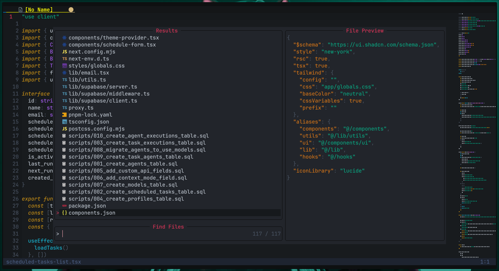

# Neovim VS Code Style - Complete User Guide

Welcome! This guide explains every shortcut in your Neovim setup in plain English. No jargon, just what each key does.

---

## FILE MANAGEMENT

### Opening & Saving Files

| Shortcut       | What It Does                                                                | Example Use                              |
| -------------- | --------------------------------------------------------------------------- | ---------------------------------------- |
| `Ctrl+B`       | **Toggle File Explorer** - Shows/hides your project folder tree on the left | Open it to browse your project files     |
| `Ctrl+P`       | **Quick Open** - Fast search for any file in your project                   | Type part of filename to jump to it      |
| `Ctrl+S`       | **Save File** - Saves your current file                                     | Use it often to not lose work!           |
| `Ctrl+W`       | **Close Current File** - Closes the file you're currently viewing           | Clean up tabs you don't need anymore     |
| `Ctrl+Shift+F` | **Search in All Files** - Searches for text across your entire project      | Find where a function is used everywhere |
| `Space+e`      | **Focus File Explorer** - Jumps your cursor to the file tree                | Quickly navigate through folders         |

### Managing Open Files (Buffers)

| Shortcut        | What It Does                                           | When to Use                            |
| --------------- | ------------------------------------------------------ | -------------------------------------- |
| `Ctrl+PageUp`   | **Previous File** - Switch to the file tab on the left | Cycle through your open files backward |
| `Ctrl+PageDown` | **Next File** - Switch to the file tab on the right    | Cycle through your open files forward  |
| `Space+fb`      | **Find Buffer** - Shows list of all open files         | Quick jump to any open file            |

---

## BASIC EDITING

### Copy, Cut, Paste (Must select text first in Visual mode)

| Shortcut | What It Does                                        | How to Use                                      |
| -------- | --------------------------------------------------- | ----------------------------------------------- |
| `Ctrl+C` | **Copy** - Copies selected text                     | Select text with mouse or `v`, then copy        |
| `Ctrl+X` | **Cut** - Cuts selected text (copy + delete)        | Select text, then cut to move it elsewhere      |
| `Ctrl+V` | **Paste** - Pastes from clipboard                   | Put your cursor where you want text, then paste |
| `Ctrl+A` | **Select All** - Selects everything in current file | Quick way to select entire file                 |

**Note:** To select text, either use your mouse or press `v` to enter Visual mode, then move with arrow keys or hjkl.

### Undo & Redo

| Shortcut | What It Does                          | When to Use                     |
| -------- | ------------------------------------- | ------------------------------- |
| `Ctrl+Z` | **Undo** - Undoes your last change    | Made a mistake? Undo it!        |
| `Ctrl+Y` | **Redo** - Redoes what you just undid | Changed your mind about undoing |

### Quick Edits

| Shortcut       | What It Does                                     | Example                        |
| -------------- | ------------------------------------------------ | ------------------------------ |
| `Ctrl+D`       | **Duplicate Line** - Copies current line below   | Quickly repeat a line of code  |
| `Ctrl+/`       | **Toggle Comment** - Comments/uncomments code    | Turn code into comment or back |
| `Ctrl+Shift+K` | **Delete Line** - Deletes entire current line    | Remove unwanted line quickly   |
| `Alt+Shift+J`  | **Move Line Down** - Moves current line down one | Reorder your code              |
| `Alt+Shift+K`  | **Move Line Up** - Moves current line up one     | Reorder your code              |

---

## NAVIGATION BETWEEN WINDOWS

### Moving Between Splits (Code Files & Terminal)

You can have multiple files and terminal open at once. Use these to jump between them:

| Shortcut                     | What It Does              | Visual Guide                 |
| ---------------------------- | ------------------------- | ---------------------------- |
| `Alt+H` or `Alt+Left Arrow`  | **Move to Left Window**   | `[Current] [Left]`           |
| `Alt+L` or `Alt+Right Arrow` | **Move to Right Window**  | `[Right] [Current]`          |
| `Alt+K` or `Alt+Up Arrow`    | **Move to Top Window**    | `[Top]` above `[Current]`    |
| `Alt+J` or `Alt+Down Arrow`  | **Move to Bottom Window** | `[Current]` above `[Bottom]` |

**Important:** These work from BOTH your code editor AND from inside the terminal!

**Example Workflow:**

1. You're editing code in the main window
2. Press `Ctrl+`` to open terminal at bottom
3. Press `Alt+J` to jump into terminal
4. Run your program
5. Press `Alt+K` to jump back to your code

---

## RESIZING WINDOWS

### Making Windows Bigger or Smaller

| Shortcut            | What It Does                                       | Visual Result                    |
| ------------------- | -------------------------------------------------- | -------------------------------- |
| `Shift+Up Arrow`    | **Increase Height** - Makes current window taller  | Terminal gets bigger vertically  |
| `Shift+Down Arrow`  | **Decrease Height** - Makes current window shorter | Terminal gets smaller vertically |
| `Shift+Right Arrow` | **Increase Width** - Makes current window wider    | Split gets wider                 |
| `Shift+Left Arrow`  | **Decrease Width** - Makes current window narrower | Split gets narrower              |

**Alternative Method:** Press `Space` then an Arrow key (same directions as above)

**Works From:** Both code editor and terminal!

**Typical Use Case:**

- Terminal too small? Press `Shift+Up` a few times to make it bigger
- Side-by-side code files need different widths? Use `Shift+Left/Right`

---

## SPLIT SCREEN MANAGEMENT

### Creating Splits

| Shortcut     | What It Does                                     | When to Use                 |
| ------------ | ------------------------------------------------ | --------------------------- |
| `Ctrl+\`     | **Vertical Split** - Divides screen left/right   | View two files side-by-side |
| `Ctrl+Alt+\` | **Horizontal Split** - Divides screen top/bottom | View two files stacked      |
| `Ctrl+W`     | **Close Split** - Closes current split window    | Done with a split           |

**Example:**

- Press `Ctrl+\` to split vertically
- Press `Ctrl+P` to open another file in the new split
- Use `Alt+H` and `Alt+L` to switch between them

---

## TERMINAL

### Opening & Using the Terminal

| Shortcut | What It Does                                                          | Details                                |
| -------- | --------------------------------------------------------------------- | -------------------------------------- |
| `Ctrl+`` | **Toggle Terminal** - Opens/closes terminal at bottom                 | Like VS Code's integrated terminal     |
| `Esc`    | **Exit Terminal Mode** - Gets you out of terminal back to normal mode | You can then navigate away or close it |

**Terminal Workflow:**

1. Press `Ctrl+`` to open terminal
2. Terminal opens at bottom, you're automatically in insert mode (can type)
3. Run your commands (like `python script.py` or `gcc main.c`)
4. Press `Alt+K` to jump back to code (or `Esc` then `Alt+K`)
5. Press `Ctrl+`` again to hide terminal (it remembers your session)

**Terminal Tips:**

- `Ctrl+`` is the primary terminal shortcut (others are disabled)
- The terminal stays open in the background when hidden
- Your command history is preserved
- Resize it with `Shift+Up/Down` when you need more space

---

## CODE INTELLIGENCE (LSP Features)

### Smart Code Navigation

These features work when you have a language server installed (like for Python, C, Lua):

| Shortcut   | What It Does                                                          | Example Use                                                    |
| ---------- | --------------------------------------------------------------------- | -------------------------------------------------------------- |
| `gd`       | **Go to Definition** - Jumps to where a function/variable is defined  | Click on `calculateTotal()` and press `gd` to see the function |
| `gr`       | **Find References** - Shows everywhere this function/variable is used | See all places you call a function                             |
| `K`        | **Hover Documentation** - Shows info about function/variable          | See what parameters a function takes                           |
| `F2`       | **Rename Symbol** - Renames variable/function everywhere              | Rename `oldName` to `newName` in entire project                |
| `Space+ca` | **Code Actions** - Shows available fixes and refactors                | Get suggestions to fix errors                                  |

---

## SEARCHING

### Finding Things in Your Project

| Shortcut       | What It Does                                                             | Best For                               |
| -------------- | ------------------------------------------------------------------------ | -------------------------------------- |
| `Ctrl+F`       | **Search & Replace in Current File** - Find/replace text in current file | "Replace variable in current file"     |
| `Ctrl+Shift+F` | **Search & Replace in All Files** - Find/replace text across project     | "Replace variable name across project" |
| `Ctrl+P`       | **Find Files** - Search by filename                                      | "Where is that config file?"           |
| `Ctrl+Shift+P` | **Search Files Containing Text** - Find files with specific content      | "Find files that use this API"         |
| `Ctrl+Q`       | **Search in Current File** - Find text in current file for navigation    | "Jump to line in current file"         |
| `Space+ff`     | **Find Files** (alternative to Ctrl+P)                                   | Same as Ctrl+P                         |
| `Space+fg`     | **Live Grep** - Search text across project                               | Advanced text searching                |
| `Space+fh`     | **Help Tags** - Search Neovim documentation                              | Learn more about Neovim features       |
| `Esc`          | **Clear Highlights** - Removes search highlighting                       | Clean up after searching               |

---

## VISUAL MODES

### Selecting Text

| Command | What It Does                                         | How to Use                                  |
| ------- | ---------------------------------------------------- | ------------------------------------------- |
| `v`     | **Visual Mode** - Select text character by character | Press `v`, then move cursor to select       |
| `V`     | **Visual Line Mode** - Select entire lines           | Press `V`, then use up/down to select lines |
| `Alt+V` | **Visual Block Mode** - Select rectangular blocks    | Press `Alt+V`, select columns of text       |

**After selecting text, you can:**

- `Ctrl+C` to copy
- `Ctrl+X` to cut
- `Ctrl+/` to comment
- `d` to delete
- `y` to yank (copy)

---

## THEME CUSTOMIZATION

| Shortcut   | What It Does                                                            | Details                                                       |
| ---------- | ----------------------------------------------------------------------- | ------------------------------------------------------------- |
| `Space+tt` | **Toggle Theme** - Switches between Arctic, Gruvbox, and Bearded themes | Cycle through three main themes                               |
| `Space+th` | **Toggle Bearded Flavor** - Switches between 30+ Bearded theme styles   | Includes: Black series, Monokai variants, Solarized, and more |

**Available Themes:**

- **Arctic**: Modern dark theme
- **Gruvbox**: Classic warm theme
- **Bearded**: Highly customizable with 30+ flavors (press `Space+th` to cycle)

**Bearded Theme Flavors Include:**

- **Black series**: black-&-amethyst, black-&-diamond, black-&-emerald, black-&-gold, black-&-ruby
- **Monokai variants**: monokai-terra, monokai-metallian, monokai-black, monokai-stone
- **Solarized**: solarized-dark, solarized-light, solarized-reversed
- **Arc variants**: arc, arc-blueberry, arc-eggplant
- **And many more**: oceanic, stained-purple/blue, vivid-black/light/purple, earth, coffee

---

## ADDITIONAL SHORTCUTS

### Tab Management

| Shortcut         | What It Does                              | When to Use                 |
| ---------------- | ----------------------------------------- | --------------------------- |
| `Ctrl+T`         | **New Tab** - Opens a new tab             | Start fresh workspace       |
| `Ctrl+Tab`       | **Next Tab** - Switch to next tab         | Cycle through tabs forward  |
| `Ctrl+Shift+Tab` | **Previous Tab** - Switch to previous tab | Cycle through tabs backward |

### Misc Useful Commands

| Shortcut   | What It Does              | Details                 |
| ---------- | ------------------------- | ----------------------- |
| `Space+ff` | **Telescope Find Files**  | Alternative file finder |
| `Space+fg` | **Telescope Search Text** | Alternative text search |
| `Space+fb` | **Telescope Buffers**     | See all open files      |

---

## QUICK START WORKFLOW

Here's a typical coding session:

1. **Open Neovim:** `nvim` in your terminal
2. **Open File Explorer:** `Ctrl+B`
3. **Navigate and open a file:** Use arrow keys, press Enter
4. **Start editing:** Just start typing (press `i` if nothing happens)
5. **Save your work:** `Ctrl+S`
6. **Open terminal:** `Ctrl+``
7. **Run your code:** Type your command (like `python main.py`)
8. **Jump back to code:** `Alt+K`
9. **Need another file side-by-side?:** `Ctrl+\` then `Ctrl+P` to open another file
10. **Switch between files:** `Alt+H` and `Alt+L`
11. **Resize windows:** `Shift+Arrow Keys`
12. **Close file:** `Ctrl+W`

---

## MODES EXPLAINED

Neovim has different modes. Here's what you need to know:

| Mode              | What It Is                               | How to Enter                | How to Exit         |
| ----------------- | ---------------------------------------- | --------------------------- | ------------------- |
| **Normal Mode**   | Default mode for navigation and commands | Press `Esc`                 | N/A (default state) |
| **Insert Mode**   | For typing and editing text              | Press `i`                   | Press `Esc`         |
| **Visual Mode**   | For selecting text                       | Press `v`                   | Press `Esc`         |
| **Terminal Mode** | When you're in the terminal              | Open terminal with `Ctrl+`` | Press `Esc`         |

**Most Important Rule:** When in doubt, press `Esc` to get back to Normal mode!

---

## TROUBLESHOOTING

### Common Issues

**Problem:** Keyboard shortcuts not working

- **Solution:** Press `Esc` to get back to Normal mode first

**Problem:** Can't type in the terminal

- **Solution:** The terminal opens in Insert mode automatically. Just start typing!

**Problem:** Terminal disappeared but I didn't close it

- **Solution:** Press `Ctrl+`` to bring it back - it's still running in the background

**Problem:** Can't switch between windows

- **Solution:** Make sure you're not in Insert mode. Press `Esc` first, then use `Alt+Arrow Keys`

**Problem:** Accidentally entered a weird mode

- **Solution:** Press `Esc` multiple times to get back to Normal mode

**Problem:** File explorer won't open

- **Solution:** Wait for plugins to load (first time takes a moment), or restart Neovim

---

## TIPS FOR BEGINNERS

1. **Save Often:** Get in the habit of pressing `Ctrl+S` frequently
2. **Use Esc Liberally:** When something feels wrong, press `Esc`
3. **Start Simple:** Don't try to learn everything at once. Start with:
   - Opening files (`Ctrl+B` and `Ctrl+P`)
   - Editing (just type normally)
   - Saving (`Ctrl+S`)
   - Using terminal (`Ctrl+``)
4. **Mouse Works:** You can use your mouse to click, scroll, and select - don't feel pressured to use only keyboard
5. **Copy/Paste Works Normally:** Select with mouse, then `Ctrl+C` and `Ctrl+V` work as expected
6. **Terminal is Your Friend:** Use `Ctrl+`` often - run your code, see output, all without leaving Neovim

---

## ADVANCED TIPS

Once you're comfortable, try these:

1. **Split workflow:** Use `Ctrl+\` to have code on left, documentation/reference on right
2. **Multiple terminals:** Open a split, then open terminal there for separate terminal instances
3. **Quick navigation:** Learn `gd` (go to definition) - massive time saver
4. **Code actions:** When you see an error, try `Space+ca` for quick fixes
5. **Search everywhere:** `Ctrl+Shift+F` is incredibly powerful for large projects

---

## GETTING HELP

- **In Neovim:** Type `Space+fh` to search help documentation
- **Show all keybindings:** Press `Space` and wait - a menu will appear showing available commands
- **Forgot a command:** Check this guide!

---

## SUMMARY CHEAT SHEET

**Most Used Commands:**

- `Ctrl+B` - File explorer
- `Ctrl+P` - Quick open file
- `Ctrl+S` - Save
- `Ctrl+`` - Terminal
- `Alt+Arrow Keys` - Navigate between windows
- `Shift+Arrow Keys` - Resize windows
- `Ctrl+C/V` - Copy/Paste
- `Ctrl+Z/Y` - Undo/Redo
- `Esc` - Get back to Normal mode

**Remember:** This is set up to feel like VS Code. If you know VS Code, most shortcuts will feel familiar!
